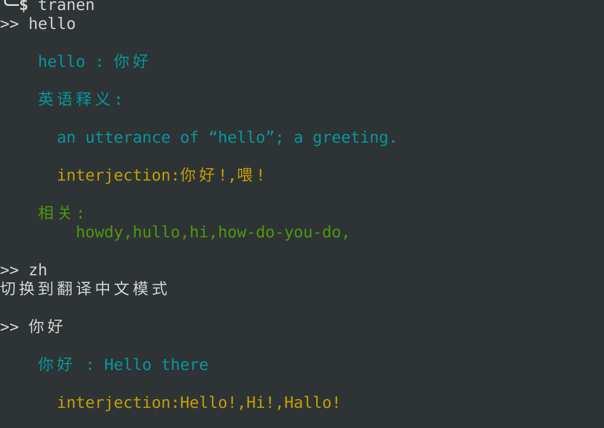
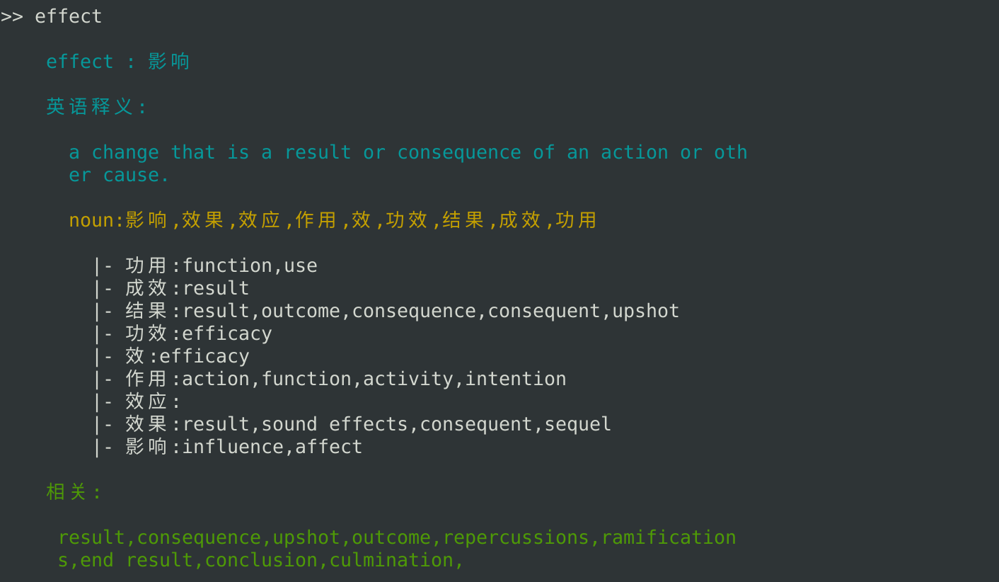

# 注意事项
1. 程序默认使用translate.google.cn获取翻译内容
2. 如果.cn域名不可用或者获取超时将自动使用代理，到translate.google.com获取翻译内容
3. 代理使用的是监听在本地的8123端口(https://localhost:8123)
4. Linux使用的socks代理需要转换成https代理才可用(可用polipo进行转换,如不知如何使用请自行搜索解决)

# 功能
* **中英互译(单词、句子)**
* **支持代理**
* **提取图片字符并翻译(英译中)**
* **程序内翻译语言切换**

# 部分运行效果截图 

# 安装
## 需要在setup.py目录下进行

      sudo pip3 install -r requirements.txt
      sudo ./setup.py install

# 基本用法
## 以下二者区别是，获取结果后不退出程序(退出按Ctrl-c)，和获取结果后即退出
* 终端输入**tranen**或者**tranzh**，之后输入英文或者中文即可得到翻译结果
* 终端输入**tranen "English content"** 或者**tranzh 中文内容**来获取结果
* 在程序运行时输入**zh** 或 **en** 进行翻译语言切换 
   * zh : 进入翻译中文模式
   * en : 进入翻译英文模式

# 截图翻译
1. 先按安装步骤完成程序部署
2. 终端键入tranpic直接运行
3. 利用截图软件截图保存到指定位置，默认是~/Pictures/pic，可修改
4. 可以设置截图软件默认保存位置为tranpic检测的文件位置，截图自动保存，并设置快捷键截图，3方式配合食用更佳
5. 后期将增加双击或鼠标提取翻译到可视化窗口

# 依赖
1. sysv_ipc pytessertact sys re json readline warnings urllib termcolor os time requests socket pillow ast pickle math ...
2. 运行环境是python3,可以选择运行时报错再来用pip3或其他方式安装对应模块

# 待做
* **爬取数据存储于数据库用于离线翻译**
